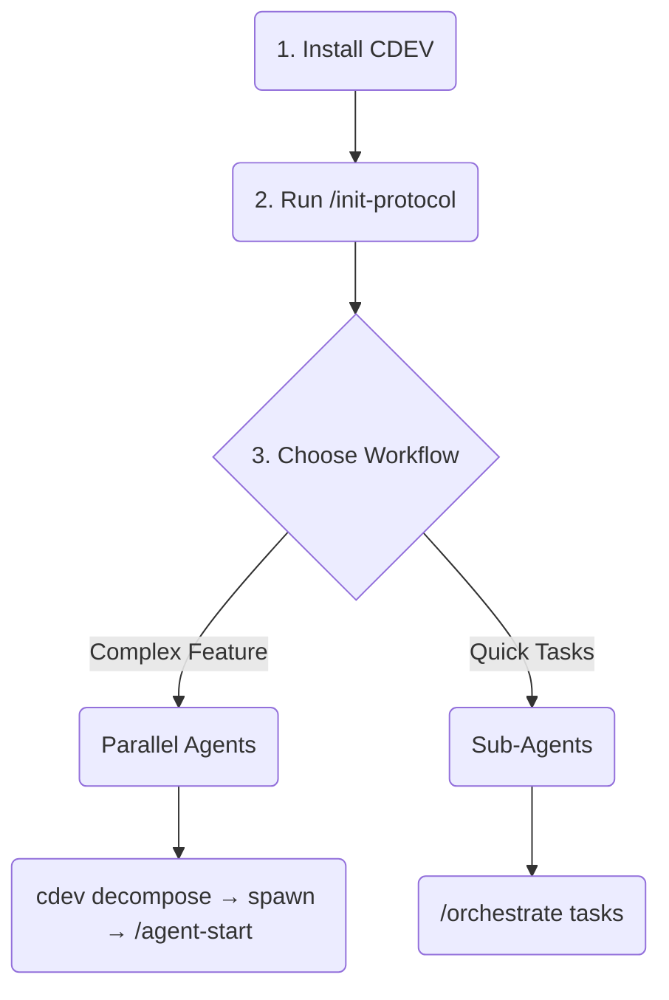
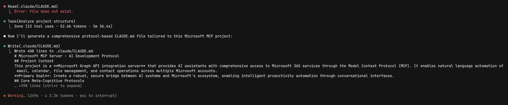

# CDEV: AI-Powered Development Orchestration System

**Version**: 0.0.22  
**License**: CC-BY-NC-SA-4.0  
**Requirements**: Node.js ≥ 16.0.0  
**Community**: [GitHub Issues](https://github.com/AOJDevStudio/cdev/issues) | [NPM Package](https://www.npmjs.com/package/@aojdevstudio/cdev)

[](https://www.npmjs.com/package/@aojdevstudio/cdev)
[](https://www.npmjs.com/package/@aojdevstudio/cdev)
[](https://www.npmjs.com/package/@aojdevstudio/cdev)
[](https://github.com/AOJDevStudio/cdev/actions)
[](https://creativecommons.org/licenses/by-nc-sa/4.0/)
[](https://nodejs.org/)

---

## What is CDEV?

Imagine you're building a house. Traditional development is like having one worker do everything sequentially - lay the foundation, then build walls, then install plumbing. CDEV is like having a smart construction manager who can either:

1. **Split the work across multiple specialists** (parallel agents) - the electrician, plumber, and carpenter all work simultaneously in different rooms
2. **Help one expert juggle multiple tasks efficiently** (concurrent sub-agents) - like a master craftsman who seamlessly switches between different tools

CDEV orchestrates AI development assistants (like Claude) to work this way, helping you build software 2-4x faster by intelligently breaking down complex tasks and managing their execution.

> ⭐ **Star this project** to support development and get notified of updates that make AI-assisted development even more powerful!

---

## 🔑 Why CDEV?

### The Problem It Solves

Developers waste hours on repetitive tasks, context switching, and managing complex workflows. AI assistants can help, but they often:

- Get confused with large codebases
- Make conflicting changes
- Lose context between tasks
- Generate code that doesn't follow your project's patterns

### The CDEV Solution

**1. Smart Task Decomposition**  
Like a project manager who knows exactly how to divide work, CDEV breaks complex features into independent pieces that can be developed simultaneously without conflicts.

**2. Intelligent Quality Gates**  
Built-in hooks act like automated code reviewers, catching common AI mistakes before they happen - wrong dates, exposed secrets, or breaking changes.

**3. Universal Task Understanding**  
Whether you paste a to-do list, reference a Linear ticket, or describe what you need, CDEV understands and orchestrates the work automatically.

### Real Impact

- **2-4x faster development** through parallel execution
- **Zero merge conflicts** with isolated Git worktrees
- **Consistent code quality** via automated validation
- **Less mental overhead** with managed context switching

📘 [**Read the Full Guide**](docs/parallel-workflow.md) to see step-by-step examples of CDEV in action.

---

## 🧭 Quick Navigation

- [Quick Start Guide](#-quick-start-guide) ⭐
- [Installation & Setup](#-setup--updates)
- [Essential First Step](#-essential-first-step-initialize-cdev)
- [Two Powerful Workflows](#-two-powerful-workflows)
- [Smart Commands](#-smart-commands-that-understand-you)
- [Safety Net (Hooks)](#-built-in-safety-net)
- [Documentation](#-documentation--resources)
- [Examples](#-real-world-examples)
- [Credits](#-credits--acknowledgments)
- [Contributing](#-contributing)

---

## 🚦 Quick Start Guide

Your journey with CDEV in 3 simple steps:



**Step 1:** Install CDEV in your project

```bash
# One-time use (recommended for trying CDEV)
npx @aojdevstudio/cdev@latest install

# OR install as a dev dependency
npm install --save-dev @aojdevstudio/cdev
```

**Step 2:** Initialize in your project _(CRITICAL!)_

```bash
/init-protocol  # Must run BEFORE any other commands!
```

**Step 3:** Choose your workflow:

- **Big Feature?** → Use parallel agents (multiple Claude windows)
- **Quick Tasks?** → Use /orchestrate (single Claude window)

---

## 🛠 Setup & Updates

**Installation Options:**

```bash
# Option 1: One-time use with npx (no installation needed)
npx @aojdevstudio/cdev@latest install

# Option 2: Install as project dev dependency
npm install --save-dev @aojdevstudio/cdev
# Then run: npx cdev install

# Update existing installation
npm update @aojdevstudio/cdev
```

✅ Automatic Claude configuration with CLAUDE.md generation  
✅ Intelligent project analysis and complexity scoring  
✅ Cross-platform support (Windows, macOS, Linux)  
✅ Multiple package managers (npm, pnpm, yarn, bun)

### 🐍 Python Scripts (Optional Enhancement)

For the best performance, CDEV uses Python scripts. Don't worry - setup is simple:

1. **Install Python 3.11+** (you probably already have it)
2. **Install UV** - a fast Python package manager:

```bash
# macOS
brew install uv

# Linux/WSL
curl -LsSf https://astral.sh/uv/install.sh | sh

# Windows
powershell -c "irm https://astral.sh/uv/install.ps1 | iex"
```

✨ **Why UV?** It's 10-100x faster than pip and handles dependencies automatically - no virtual environments needed!

⸻

⚡ Quick Start Options

**Option 1: Interactive Setup (Recommended)**

1. Run `npx @aojdevstudio/cdev` in your project
2. Let CDEV analyze your project structure automatically
3. Choose between simple or advanced protocol generation
4. Configure Linear integration if desired
5. Start using enhanced Claude commands immediately

**Option 2: Manual Installation**

1. Clone the repository

```bash
git clone https://github.com/AOJDevStudio/cdev.git
```

2. Install and configure

```bash
cd cdev
npm install
npm link
```

⸻

## 🎯 Essential First Step: Initialize CDEV

**IMPORTANT:** Before using any workflows, you MUST run init-protocol so Claude understands your project:

```bash
/init-protocol  # Run this FIRST in your project root!
```

> 💡 **Why not use Anthropic's /init?** While Claude's built-in `/init` provides basic setup, CDEV's `/init-protocol` is **specifically designed for production development**. It detects your exact frameworks, creates custom hooks for your tech stack, and generates a comprehensive CLAUDE.md with project-specific instructions that make Claude significantly more effective.

### What This Does For You:

1. **Scans Your Project** - Detects all frameworks, languages, and patterns
2. **Creates CLAUDE.md** - Custom AI instructions tailored to YOUR codebase
3. **Sets Quality Standards** - Based on your existing code style
4. **Configures Hooks** - Prevents common mistakes in your tech stack

### Examples of Smart Detection:

```bash
# Empty project?
/init-protocol  # Sets up for greenfield development

# React app?
/init-protocol  # Adds component patterns, hook rules, testing practices

# Python API?
/init-protocol  # Configures type hints, async patterns, docstrings

# Microservices?
/init-protocol  # Sets service boundaries, API standards
```

**This one command makes Claude 10x more effective at understanding your project!**

⸻

## 🚀 Two Powerful Workflows

After running `/init-protocol`, choose your workflow:

### 1. Parallel Agent Workflow - Like Multiple Developers

**When to use:** Building a complete authentication system, major refactoring, or any feature touching multiple parts of your codebase.

**Complete Step-by-Step Process:**

```bash
# 1. Decompose your task into parallel agents
cdev decompose LINEAR-123
# Creates: deployment-plan.json with frontend, backend, test agents

# 2. Spawn agents in separate Git worktrees
cdev spawn deployment-plan.json
# Creates directories: auth_frontend/, auth_backend/, auth_tests/

# 3. Open EACH directory in a SEPARATE Claude window
# In auth_frontend/ Claude window:
/agent-start  # Starts the frontend agent's TDD workflow

# In auth_backend/ Claude window:
/agent-start  # Starts the backend agent's TDD workflow

# In auth_tests/ Claude window:
/agent-start  # Starts the test agent's TDD workflow

# 4. Monitor progress from your main terminal
cdev status
# Shows: ✓ Frontend: 80% complete, Backend: 60%, Tests: 40%

# 5. When all agents complete their work
cdev commit  # Intelligently merges all branches without conflicts
```

**🔑 Key Point:** Each agent needs `/agent-start` to begin its systematic workflow!

### 2. Concurrent Sub-Agent Workflow - Like One Expert Multitasking

**When to use:** Multiple related tasks in one area, quick fixes across files, or when you want to stay in one Claude conversation.

**How it works:**

```bash
# Just tell Claude what you need done
/orchestrate "Fix all linting errors, add missing tests, update docs"

# CDEV creates sub-agents that work concurrently:
# - Linting Agent: Fixes style issues across all files
# - Testing Agent: Adds tests for uncovered code
# - Docs Agent: Updates documentation

# All happen in your current Claude session - no switching needed!
```

---

## 🎯 Smart Commands That Understand You

### /agent-start - Professional Test-Driven Development

```bash
/agent-start  # Starts a systematic development workflow
```

**What happens:** CDEV guides Claude through 7 phases:

1. **Explore** - Understand the codebase
2. **Plan** - Design the solution
3. **Test** - Write tests first (TDD)
4. **Code** - Implement to pass tests
5. **Refactor** - Clean up the code
6. **Validate** - Ensure quality
7. **Commit** - Save with meaningful messages

### /orchestrate - Your Universal Task Manager

```bash
# Works with ANY task format:
/orchestrate tasks.md          # ✓ Markdown checklists
/orchestrate TODO.txt          # ✓ Plain text lists
/orchestrate LINEAR-456        # ✓ Linear/Jira tickets
/orchestrate "fix bug, add feature, write tests"  # ✓ Simple descriptions

# Preview what will happen:
/orchestrate tasks.md --dry-run
```

**Magic:** CDEV reads your tasks in any format and automatically creates an execution plan. It's like having an assistant who just "gets it".

### /init-protocol - Production-Grade Project Setup

```bash
/init-protocol  # Superior to Claude's basic /init command
```

**Why it's better than /init:**

- **Deep Analysis** vs basic file listing
- **Framework-Specific Rules** vs generic suggestions
- **Custom Hooks** vs no protection
- **Team Standards** vs individual preferences

**The Difference in Action:**

<details>
<summary>📊 Click to see the dramatic difference between /init-protocol vs /init</summary>

| Aspect                | `/init` (Basic)  | `/init-protocol` (CDEV)            |
| --------------------- | ---------------- | ---------------------------------- |
| **Token Usage**       | ~500-1k tokens   | 50k+ tokens                        |
| **Analysis Time**     | 2-5 seconds      | 1-2 minutes                        |
| **Output**            | Simple file list | Complete development protocols     |
| **Context Depth**     | Surface level    | Deep codebase understanding        |
| **Framework Support** | Generic          | Framework-specific best practices  |
| **Customization**     | None             | Hooks, standards, team conventions |


_Real example: /init-protocol analyzing a Microsoft Graph API integration project - 13 tool uses, 52.6k tokens, comprehensive protocol generation_

**Example Output Comparison:**

```bash
# Standard /init output:
"I found 12 files in your project. Here's what I see:
- src/index.js
- package.json
- README.md
..."

# /init-protocol output:
"Analyzing project structure...
✓ Detected: Microsoft Graph API Integration Server
✓ Framework: Node.js with Express
✓ Architecture: RESTful API with OAuth2
✓ Creating comprehensive development protocols...

Generated:
- Core Meta-Cognitive Protocols for AI assistants
- Framework-specific validation hooks
- Team collaboration standards
- Automated quality gates
..."
```

</details>

**What it creates for you:**

1. **CLAUDE.md** - Comprehensive project instructions
2. **Custom Hooks** - Prevent framework-specific mistakes
3. **Quality Gates** - Enforce your team's standards
4. **Smart Context** - Claude understands YOUR patterns

**Framework-specific enhancements:**

- **React**: Component patterns, hook rules, testing practices
- **Vue**: Composition API, reactivity patterns, Pinia state
- **Python**: Type hints, docstrings, async/await patterns
- **Node.js**: Middleware patterns, error handling, validation
- **And 20+ more frameworks...**

### /commit - Git Commits That Make Sense

```bash
/commit  # CDEV writes the perfect commit message
```

**Example output:**

```
feat(auth): implement JWT token refresh with Redis caching

- Add token refresh endpoint with 24h expiry
- Integrate Redis for token blacklisting
- Add comprehensive test coverage (98%)
- Update API documentation

Closes: LINEAR-123
```

---

## 🛡️ Built-in Safety Net

### Why Hooks Matter

AI assistants sometimes make predictable mistakes. CDEV's hooks catch these automatically:

### Common Saves:

**🚫 Prevents API Key Exposure**

```python
# AI tries to add: api_key = "sk-proj-abc123"
# Hook blocks: "SECURITY: Never commit API keys!"
```

**📅 Fixes Wrong Dates**

```python
# AI writes: "Updated: December 2023"
# Hook corrects: "Updated: July 2024"
```

**🔒 Protects Templates**

```python
# AI modifies: user_{{TEMPLATE_VAR}}_config
# Hook prevents: "Don't edit template files!"
```

### Hook Configuration Note

> **Important:** CDEV automatically configures hooks to work with Claude Code's working directory requirements. If you're having issues with hooks not executing, see our [troubleshooting guide](docs/troubleshooting-python-scripts.md#hook-execution-issues).

### Custom Hooks

Add your own rules:

```python
# Enforce your team's standards
if "console.log" in code:
    return "Use proper logging: logger.info()"
```

---

## 📦 Works With Your Stack

### Automatic Framework Detection

CDEV adapts to your project:

**Frontend Frameworks**

- ⚛️ **React/Next.js** - Component testing, hook validation
- 🖖 **Vue/Nuxt** - Composition API best practices
- 🅰️ **Angular** - Service injection patterns
- 🎯 **Svelte** - Store management

**Backend Technologies**

- 🟢 **Node.js** - Express/Fastify middleware
- 🐍 **Python** - Type hints, async patterns
- 🦀 **Rust** - Memory safety checks
- ☕ **Java** - Spring Boot conventions

**Special Environments**

- 🐳 **Docker/K8s** - Container best practices
- 📱 **React Native** - Platform-specific code
- 🤖 **ML Projects** - Notebook integration
- ⚡ **Serverless** - Function optimization

🧩 **No configuration needed** - CDEV detects and adapts automatically!

⸻

## 📚 Documentation & Resources

• 📖 [Installation Guide](docs/installation.md)
• 🏗️ [Parallel Workflow Tutorial](docs/parallel-workflow.md)
• 🚀 [Custom Commands Reference](docs/custom-commands.md)
• 🧑‍💻 [Hook Development Guide](docs/hooks-reference.md)

### 🐍 Python Scripts Documentation

• 🔧 [UV Installation Guide](docs/uv-installation-guide.md) - Set up UV package manager
• 📘 [Standalone Scripts Guide](docs/standalone-scripts-guide.md) - Understanding the script architecture
• 🔄 [Migration Guide](docs/migration-guide.md) - Migrate from Shell/JS to Python
• 📝 [Script Usage Examples](docs/script-usage-examples.md) - Practical examples for all scripts
• 📊 [YAML Output Formats](docs/yaml-output-formats.md) - Output schema documentation
• 🔍 [Troubleshooting Guide](docs/troubleshooting-python-scripts.md) - Common issues and solutions
• 📈 [Old vs New Comparison](docs/old-vs-new-comparison.md) - Benefits of the migration

⸻

## 💡 Real-World Examples

### Example 1: Building an Authentication System

**The Task:** "Add complete user authentication with JWT tokens"

```bash
# 1. Break it down intelligently
cdev decompose LINEAR-789
```

**CDEV creates three parallel agents:**

```yaml
auth_backend_agent:
  - Implement JWT token generation
  - Add refresh token logic
  - Create auth middleware
  - Set up Redis for sessions

auth_frontend_agent:
  - Build login/signup forms
  - Add password reset flow
  - Implement token storage
  - Create auth context/hooks

auth_test_agent:
  - Write API integration tests
  - Add frontend component tests
  - Create E2E auth flows
  - Set up test fixtures
```

**Result:** 3 developers working simultaneously, 4 hours → 1.5 hours

### Example 2: Quick Multi-Task Fix

**The Need:** "Our API is slow and hard to debug"

```bash
/orchestrate "Add performance logging, optimize database queries, add caching"
```

**CDEV runs three sub-agents concurrently:**

1. **Performance Logger**
   - Adds timing to all routes
   - Creates performance dashboard
2. **Query Optimizer**
   - Finds N+1 queries
   - Adds proper indexes
3. **Cache Layer**
   - Implements Redis caching
   - Adds cache invalidation

**Result:** One Claude session handles all three improvements perfectly

### Example 3: Refactoring Legacy Code

```bash
# Complex refactor made simple
/orchestrate "Refactor user service to use TypeScript, add tests, update docs"
```

**CDEV coordinates:**

- TypeScript migration (preserves all functionality)
- Test creation (achieves 90% coverage)
- Documentation updates (inline + README)

**All while ensuring nothing breaks!**

⸻

## 🤝 Join Our Community

### Get Help

- 💬 [GitHub Discussions](https://github.com/AOJDevStudio/cdev/discussions) - Ask questions, share tips
- 🐞 [Report Issues](https://github.com/AOJDevStudio/cdev/issues) - Found a bug? Let us know
- 📺 [Video Tutorials](https://youtube.com/@AOJDevStudio) - See CDEV in action

### Stay Updated

- ⭐ **Star the repo** for release notifications
- 🗨️ [Request Features](https://github.com/AOJDevStudio/cdev/issues/new?labels=enhancement)
- 🐦 Follow [@AOJDevStudio](https://twitter.com/AOJDevStudio) for tips

⸻

## 🙏 Credits & Acknowledgments

CDEV builds upon brilliant work from the open-source community:

### Core Inspirations

- **[Context-Engineering](https://github.com/davidkimai/Context-Engineering)** by David Kimai  
  The foundation for our `/init-protocol` command and context management system. Their pioneering work on AI context optimization made CDEV's intelligent project understanding possible.

- **[Claude Code Hooks Mastery](https://github.com/disler/claude-code-hooks-mastery)** by Disler  
  Inspired our parallel agent architecture and hook system. Their innovative approach to managing Claude workflows sparked the idea for CDEV's dual-mode system.

- **[Anthropic Documentation](https://docs.anthropic.com/)**  
  Claude's official docs provided the groundwork for understanding AI assistant capabilities and best practices that CDEV enhances.

### Special Thanks

- The Claude community for continuous feedback and feature ideas
- Early adopters who battle-tested CDEV in production environments
- Contributors who helped refine the parallel workflow system

_Standing on the shoulders of giants to make AI-assisted development accessible to all._

⸻

## 🧑‍💻 Contributing

We welcome all contributions!

1. Fork the repository
2. Create your feature branch (`git checkout -b feature/amazing-feature`)
3. Run tests (`npm test`)
4. Commit changes using conventional commits
5. Push to branch (`git push origin feature/amazing-feature`)
6. Open a Pull Request

📋 See our [Roadmap](ROADMAP.md#how-to-contribute) for contribution guidelines and future plans.

⸻

## 📄 License

Creative Commons Attribution-NonCommercial-ShareAlike 4.0 International (CC BY-NC-SA 4.0)

This means:

- ✅ Use freely for personal and internal projects
- ✅ Modify and build upon the work
- ✅ Share with attribution
- ❌ Commercial use requires permission

See [LICENSE](LICENSE) for details.

---

---

<p align="center">
  <strong>Built with ❤️ by developers who were tired of slow development</strong><br>
  <em>Now you can build at the speed of thought with AI</em>
</p>

<p align="center">
  <a href="https://github.com/AOJDevStudio/cdev/stargazers">⭐ Star</a> •
  <a href="https://github.com/AOJDevStudio/cdev/fork">🍴 Fork</a> •
  <a href="https://github.com/AOJDevStudio/cdev/issues/new">💡 Suggest</a>
</p>
