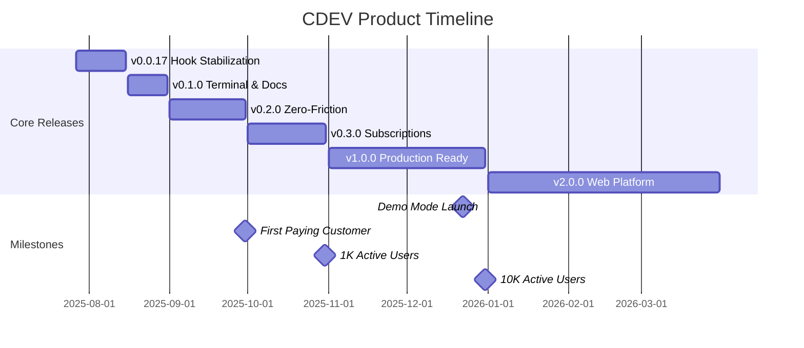

# CDEV Roadmap

**Target:** Launch CDEV v1.0.0 as the premier Claude Code workflow automation tool
**Completion:** March 31, 2025
**Success Metric:** 10,000 monthly active developers with 80%+ retention

## Deliverables

### v0.0.17 - Hook System Stabilization
**Owner:** Core Team
**Due Date:** August 15, 2025
**Definition of Done:** 
- All hooks execute reliably across npm/yarn/pnpm/bun
- Error messages are clear and actionable
- Installation success rate > 95%
**Dependencies:** None
**Risk Level:** Low - Already in progress

### v0.1.0 - Terminal Integration & Documentation
**Owner:** Core Team
**Due Date:** August 31, 2025
**Definition of Done:**
- Users can choose terminal or Cursor for worktree opening
- Choice is persisted in user preferences
- All mermaid diagrams render correctly
- Zero duplicate content in documentation
**Dependencies:** v0.0.17 completion
**Risk Level:** Low - Clear requirements

### v0.2.0 - Zero-Friction Onboarding
**Owner:** Product Team
**Due Date:** September 30, 2025
**Definition of Done:**
- `npx @aojdevstudio/cdev demo` runs in < 30 seconds without setup
- Interactive setup wizard detects project type and configures automatically
- MCP agents report completion status to main worktree
- 80% of new users complete setup successfully
**Dependencies:** v0.1.0 completion
**Risk Level:** Medium - Requires significant UX work

### v0.3.0 - Subscription System
**Owner:** Business Team
**Due Date:** October 31, 2025
**Definition of Done:**
- Stripe integration complete with Free/Pro/Enterprise tiers
- Usage tracking for agent runs
- Self-service upgrade/downgrade flow
- Revenue dashboard operational
**Dependencies:** v0.2.0 user base established
**Risk Level:** High - Payment systems are complex

### v1.0.0 - Production Ready
**Owner:** Core Team
**Due Date:** December 31, 2025
**Definition of Done:**
- 90%+ test coverage
- < 100ms hook execution time
- Self-healing agents recover from 80% of errors
- Comprehensive error catalog with solutions
- 1,000+ paying customers
**Dependencies:** v0.3.0 subscription system
**Risk Level:** Medium - Requires extensive testing and optimization

### v2.0.0 - Web Platform
**Owner:** Platform Team
**Due Date:** March 31, 2026
**Definition of Done:**
- Web dashboard displays real-time agent status
- REST API handles 100+ requests/second
- Visual workflow designer creates valid agent configurations
- 50+ enterprise customers using platform features
**Dependencies:** v1.0.0 stability
**Risk Level:** High - Major architectural expansion

## Timeline

## Key Decisions

- **Architecture:** Hybrid JavaScript/Python for maximum compatibility, not pure JS
- **Distribution:** NPM global package, not desktop app or VS Code extension
- **Pricing Model:** Usage-based with generous free tier, not flat subscription
- **Hook System:** File-based in .claude/hooks/, not database or API-based
- **Scope:** Focus on Claude Code integration only, not general AI tool support

## Review Schedule

- August 20, 2025: v0.1.0 progress review
- September 15, 2025: Demo mode launch review
- October 15, 2025: First customer onboarding review
- November 30, 2025: v1.0.0 readiness assessment
- January 15, 2026: Platform architecture review

## Risks & Mitigation

### Technical Risks
- **Hook execution failures across package managers**
  - Mitigation: Extensive testing matrix, fallback mechanisms
- **MCP agent communication complexity**
  - Mitigation: Start with simple status reporting, iterate based on usage

### Business Risks
- **Low adoption rate**
  - Mitigation: 30-second demo mode, extensive documentation, community outreach
- **Payment processing issues**
  - Mitigation: Use proven Stripe integration, implement retry logic

### Resource Risks
- **Limited development capacity**
  - Mitigation: Focus on core features, defer nice-to-haves, encourage community contributions

## Current Sprint (July 27 - August 10, 2025)

### Active Tasks
1. **Fix hook installation system** (Owner: Core Team, Due: July 30)
2. **Add terminal choice option** (Owner: Core Team, Due: August 5)
3. **Clean up duplicate documentation** (Owner: Core Team, Due: August 7)
4. **Create error catalog** (Owner: Core Team, Due: August 10)

### Blocked Items
- None

### Completed This Sprint
- ✅ Updated version to 0.0.17
- ✅ Identified hook system issues
- ✅ Created roadmap in commitment format

---

**Last Updated:** July 27, 2025
**Next Review:** August 20, 2025
**Contact:** admin@kamdental.com