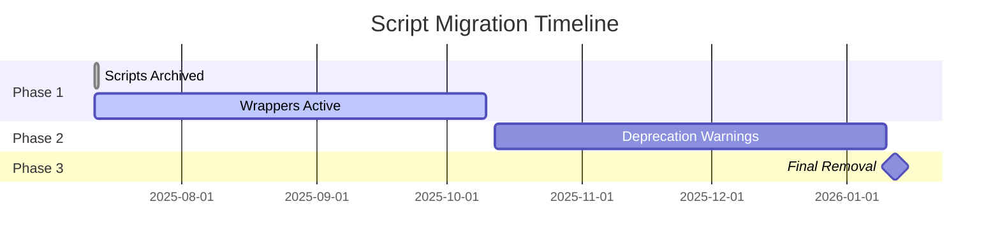

# Script Removal Timeline

This document outlines the deprecation and removal timeline for legacy shell and JavaScript scripts.

## Overview

As part of our modernization effort, all shell and JavaScript scripts have been rewritten in Python. This document provides a detailed timeline for the deprecation and eventual removal of the old scripts.

## Timeline Summary



## Detailed Timeline

### Phase 1: Initial Migration (July 2025 - October 2025)

**Status: ACTIVE** ✅

**Duration:** 3 months

**Key Activities:**
- ✅ All scripts converted to Python
- ✅ Old scripts archived to `scripts/archived/`
- ✅ Wrapper scripts created for backward compatibility
- ✅ Documentation updated
- ✅ Migration guide published

**User Impact:** Minimal - all existing workflows continue to function

**What Users Should Do:**
- Start testing Python scripts in development environments
- Update local scripts and aliases
- Review the migration guide
- Report any issues or missing features

### Phase 2: Active Deprecation (October 2025 - January 2026)

**Status: PLANNED** 🟡

**Duration:** 3 months

**Key Activities:**
- Add prominent deprecation warnings to wrapper scripts
- Include migration hints in warning messages
- Track wrapper usage metrics (optional)
- Send reminder notifications
- Update documentation with removal date

**User Impact:** Warning messages on every script execution

**Warning Message Example:**
```
⚠️  DEPRECATION WARNING: This script will be REMOVED on January 12, 2026
   
   Old: ./scripts/deploy.sh
   New: python scripts/python/deploy.py
   
   Please update your workflows NOW to avoid disruption.
   See: docs/migration-announcement.md for details.
```

**What Users Should Do:**
- Complete migration to Python scripts
- Update all automated workflows
- Update documentation and runbooks
- Ensure team members are aware of changes

### Phase 3: Final Removal (January 2026)

**Status: PLANNED** 🔴

**Date:** January 12, 2026

**Key Activities:**
- Remove all wrapper scripts
- Remove archived shell/JS scripts (optional)
- Update all documentation
- Final announcement
- Close migration-related issues

**User Impact:** Old script paths will no longer work

**What Happens:**
```bash
# This will no longer work
./scripts/deploy.sh
# Error: scripts/deploy.sh: No such file or directory

# Only this will work
python scripts/python/deploy.py
```

## Script-Specific Timeline

### High-Priority Scripts (Migrate First)

These scripts are used frequently and should be migrated as soon as possible:

| Script | Usage Frequency | Removal Date | Replacement |
|--------|----------------|--------------|-------------|
| deploy.sh | Daily | Jan 12, 2026 | deploy.py |
| test-locally.sh | Daily | Jan 12, 2026 | test-locally.py |
| agent-commit-enhanced.sh | Daily | Jan 12, 2026 | agent-commit.py |
| security-check.js | CI/CD | Jan 12, 2026 | security-check.py |

### Medium-Priority Scripts

These scripts are used regularly but less frequently:

| Script | Usage Frequency | Removal Date | Replacement |
|--------|----------------|--------------|-------------|
| spawn-agents.sh | Weekly | Jan 12, 2026 | spawn-agents.py |
| monitor-agents.sh | Weekly | Jan 12, 2026 | monitor-agents.py |
| intelligent-agent-generator.js | Weekly | Jan 12, 2026 | intelligent-agent-generator.py |

### Low-Priority Scripts

These scripts are used occasionally:

| Script | Usage Frequency | Removal Date | Replacement |
|--------|----------------|--------------|-------------|
| cache-linear-issue.sh | Monthly | Jan 12, 2026 | cache-linear-issue.py |
| resolve-conflicts.sh | As needed | Jan 12, 2026 | resolve-conflicts.py |
| prepublish.js | Release | Jan 12, 2026 | prepublish.py |
| postpublish.js | Release | Jan 12, 2026 | postpublish.py |

## Migration Checklist

Use this checklist to track your migration progress:

### For Individual Developers

- [ ] Update shell aliases/functions
- [ ] Update personal scripts
- [ ] Update IDE/editor configurations
- [ ] Test Python scripts locally
- [ ] Update local documentation

### For Team Leads

- [ ] Update team documentation
- [ ] Update CI/CD pipelines
- [ ] Update deployment scripts
- [ ] Notify team members
- [ ] Schedule migration work

### For DevOps/Infrastructure

- [ ] Update automation scripts
- [ ] Update monitoring/alerting
- [ ] Update deployment pipelines
- [ ] Ensure Python is available in all environments
- [ ] Update infrastructure as code

## Post-Removal Plan

After January 12, 2026:

1. **Error Messages**: Clear error messages will guide users to Python scripts
2. **Documentation**: All references to old scripts will be removed
3. **Support**: Migration support will continue for 1 month post-removal
4. **Cleanup**: Archived scripts may be moved to a separate legacy repository

## Getting Help

### Before Removal

- Use `--help` flag on any Python script
- Check `scripts/python/README.md`
- Open issues for migration problems
- Request features missing in Python scripts

### After Removal

- Error messages will include migration hints
- Documentation will be updated
- Legacy script repository will be available for reference

## Emergency Rollback

In case of critical issues:

1. Wrapper scripts can be temporarily restored from `scripts/archived/`
2. Git history preserves all old scripts
3. Emergency support available through issues

## Commitment to Users

We understand that migrations can be disruptive. Our commitment:

1. **Sufficient Notice**: 6-month migration period
2. **Clear Communication**: Regular updates and reminders
3. **Backward Compatibility**: Wrappers during transition
4. **Support**: Active help during migration
5. **No Surprises**: Firm removal date with no early removal

## Questions?

For questions about the removal timeline:

1. Review this document regularly for updates
2. Check the migration announcement
3. Open an issue for specific concerns
4. Contact maintainers for critical issues

---

**Last Updated:** July 12, 2025

**Next Update:** October 12, 2025 (Phase 2 start)